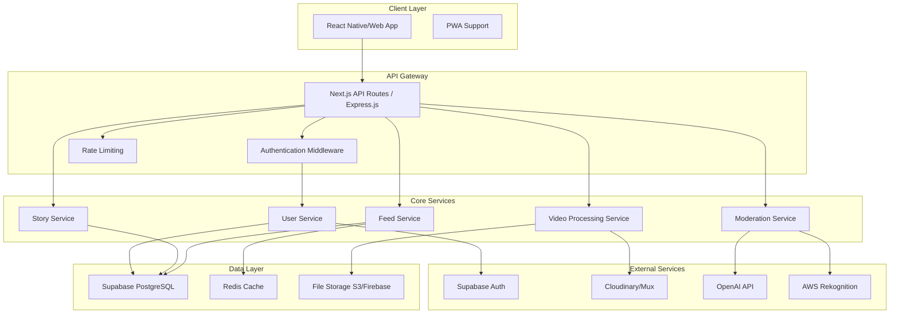

# Design Document

## Overview

Splintr is a social storytelling platform built as a modern web application with mobile-first design principles. The architecture follows a microservices approach with clear separation between frontend presentation, backend API services, content delivery, and data storage layers. The system is designed to handle video streaming, real-time user interactions, and scalable content moderation while maintaining performance and security.

## Architecture

### High-Level Architecture



### Technology Stack

**Frontend:**
- React Native (iOS/Android) or Next.js (Web PWA)
- TypeScript for type safety
- Tailwind CSS for styling
- React Query for state management and caching

**Backend:**
- Next.js API routes or Express.js with TypeScript
- Supabase for authentication and database
- Redis for caching and session management
- Background job processing with Bull Queue

**Video & Storage:**
- Cloudinary or Mux for video streaming and processing
- AWS S3 or Firebase Storage for file storage
- CDN for global content delivery

**External APIs:**
- OpenAI Moderation API for text content
- AWS Rekognition or Hive AI for video/image moderation
- Google/Apple OAuth for authentication

## Components and Interfaces

### Core Components

#### 1. Authentication Service
```typescript
interface AuthService {
  signInWithGoogle(): Promise<AuthResult>
  signInWithApple(): Promise<AuthResult>
  signOut(): Promise<void>
  getCurrentUser(): Promise<User | null>
  refreshToken(): Promise<string>
}

interface User {
  id: string
  email: string
  name: string
  avatar?: string
  createdAt: Date
  updatedAt: Date
}
```

#### 2. Video Service
```typescript
interface VideoService {
  uploadVideo(file: File, metadata: VideoMetadata): Promise<VideoUploadResult>
  processVideo(videoId: string): Promise<ProcessingResult>
  generateThumbnail(videoId: string): Promise<string>
  getStreamingUrl(videoId: string): Promise<string>
}

interface VideoMetadata {
  title?: string
  description?: string
  duration: number
  size: number
}

interface VideoUploadResult {
  videoId: string
  uploadUrl: string
  processingStatus: 'pending' | 'processing' | 'completed' | 'failed'
}
```

#### 3. Story Service
```typescript
interface StoryService {
  createStory(story: CreateStoryRequest): Promise<Story>
  updateStory(storyId: string, updates: UpdateStoryRequest): Promise<Story>
  publishStory(storyId: string): Promise<void>
  getStory(storyId: string): Promise<Story>
  validateStoryStructure(story: Story): ValidationResult
}

interface Story {
  id: string
  creatorId: string
  title: string
  description?: string
  nodes: StoryNode[]
  isPublished: boolean
  createdAt: Date
  updatedAt: Date
}

interface StoryNode {
  id: string
  videoId: string
  choices: Choice[]
  isStartNode: boolean
  isEndNode: boolean
}

interface Choice {
  id: string
  text: string
  nextNodeId: string | null
}
```

#### 4. Moderation Service
```typescript
interface ModerationService {
  scanVideo(videoId: string): Promise<ModerationResult>
  scanText(text: string): Promise<ModerationResult>
  flagContent(contentId: string, reason: string, userId: string): Promise<void>
  reviewFlaggedContent(contentId: string, decision: ModerationDecision): Promise<void>
}

interface ModerationResult {
  contentId: string
  status: 'approved' | 'flagged' | 'rejected'
  confidence: number
  categories: string[]
  reviewRequired: boolean
}
```

#### 5. Feed Service
```typescript
interface FeedService {
  getPublicFeed(pagination: PaginationParams): Promise<FeedResponse>
  getCreatorFeed(creatorId: string, pagination: PaginationParams): Promise<FeedResponse>
  refreshFeedCache(): Promise<void>
}

interface FeedItem {
  storyId: string
  creatorId: string
  creatorName: string
  creatorAvatar?: string
  title: string
  thumbnailUrl: string
  publishedAt: Date
  viewCount: number
}
```

## Data Models

### Database Schema

#### Users Table
```sql
CREATE TABLE users (
  id UUID PRIMARY KEY DEFAULT gen_random_uuid(),
  email VARCHAR(255) UNIQUE NOT NULL,
  name VARCHAR(100) NOT NULL,
  avatar_url TEXT,
  provider VARCHAR(50) NOT NULL, -- 'google' | 'apple'
  provider_id VARCHAR(255) NOT NULL,
  created_at TIMESTAMP WITH TIME ZONE DEFAULT NOW(),
  updated_at TIMESTAMP WITH TIME ZONE DEFAULT NOW()
);
```

#### Videos Table
```sql
CREATE TABLE videos (
  id UUID PRIMARY KEY DEFAULT gen_random_uuid(),
  creator_id UUID REFERENCES users(id) ON DELETE CASCADE,
  original_filename VARCHAR(255),
  duration INTEGER NOT NULL, -- in seconds
  file_size BIGINT NOT NULL, -- in bytes
  cloudinary_public_id VARCHAR(255),
  streaming_url TEXT,
  thumbnail_url TEXT,
  processing_status VARCHAR(20) DEFAULT 'pending',
  moderation_status VARCHAR(20) DEFAULT 'pending',
  moderation_result JSONB,
  created_at TIMESTAMP WITH TIME ZONE DEFAULT NOW(),
  updated_at TIMESTAMP WITH TIME ZONE DEFAULT NOW()
);
```

#### Stories Table
```sql
CREATE TABLE stories (
  id UUID PRIMARY KEY DEFAULT gen_random_uuid(),
  creator_id UUID REFERENCES users(id) ON DELETE CASCADE,
  title VARCHAR(200) NOT NULL,
  description TEXT,
  story_data JSONB NOT NULL, -- Contains the branching structure
  is_published BOOLEAN DEFAULT FALSE,
  thumbnail_url TEXT,
  view_count INTEGER DEFAULT 0,
  created_at TIMESTAMP WITH TIME ZONE DEFAULT NOW(),
  updated_at TIMESTAMP WITH TIME ZONE DEFAULT NOW(),
  published_at TIMESTAMP WITH TIME ZONE
);
```

#### Story Playthroughs Table
```sql
CREATE TABLE story_playthroughs (
  id UUID PRIMARY KEY DEFAULT gen_random_uuid(),
  story_id UUID REFERENCES stories(id) ON DELETE CASCADE,
  viewer_id UUID REFERENCES users(id) ON DELETE SET NULL,
  path_taken JSONB NOT NULL, -- Array of node IDs taken
  completed_at TIMESTAMP WITH TIME ZONE,
  session_id VARCHAR(255), -- For anonymous tracking
  created_at TIMESTAMP WITH TIME ZONE DEFAULT NOW()
);
```

#### Content Flags Table
```sql
CREATE TABLE content_flags (
  id UUID PRIMARY KEY DEFAULT gen_random_uuid(),
  content_type VARCHAR(20) NOT NULL, -- 'story' | 'video'
  content_id UUID NOT NULL,
  reporter_id UUID REFERENCES users(id) ON DELETE SET NULL,
  reason VARCHAR(100) NOT NULL,
  status VARCHAR(20) DEFAULT 'pending', -- 'pending' | 'reviewed' | 'dismissed'
  admin_notes TEXT,
  created_at TIMESTAMP WITH TIME ZONE DEFAULT NOW(),
  reviewed_at TIMESTAMP WITH TIME ZONE
);
```

## Error Handling

### Error Categories

1. **Validation Errors (400)**
   - Invalid video duration (not 15-30 seconds)
   - File size exceeds 100MB limit
   - Incomplete story branching structure
   - Invalid choice configurations

2. **Authentication Errors (401/403)**
   - Invalid or expired JWT tokens
   - Insufficient permissions for content access
   - OAuth provider authentication failures

3. **Content Errors (422)**
   - Video processing failures
   - Moderation rejection
   - Unsupported file formats

4. **System Errors (500)**
   - Database connection failures
   - External service unavailability
   - Background job processing errors

### Error Response Format
```typescript
interface ErrorResponse {
  error: {
    code: string
    message: string
    details?: Record<string, any>
    timestamp: string
    requestId: string
  }
}
```

### Retry and Fallback Strategies

- **Video Processing**: Automatic retry up to 3 times with exponential backoff
- **Moderation API**: Fallback to manual review queue if AI services fail
- **Feed Loading**: Serve cached content if database is temporarily unavailable
- **Authentication**: Graceful degradation to guest mode for content viewing

## Testing Strategy

### Unit Testing
- **Coverage Target**: 80% minimum for core business logic
- **Framework**: Jest with React Testing Library
- **Focus Areas**:
  - Story validation logic
  - Video processing workflows
  - Authentication flows
  - Moderation decision algorithms

### Integration Testing
- **API Endpoints**: Test all REST endpoints with various input scenarios
- **Database Operations**: Test CRUD operations and data integrity
- **External Services**: Mock Cloudinary, OpenAI, and AWS services
- **Authentication**: Test OAuth flows with provider simulators

### End-to-End Testing
- **Framework**: Playwright or Cypress
- **Critical User Journeys**:
  - Complete story creation and publishing flow
  - Interactive story viewing experience
  - Content moderation and flagging workflow
  - User authentication and profile management

### Performance Testing
- **Video Upload**: Test concurrent uploads and processing
- **Feed Loading**: Test pagination and caching performance
- **Story Playback**: Test video streaming under load
- **Database Queries**: Optimize and test query performance

### Security Testing
- **Authentication**: Test JWT token security and session management
- **File Upload**: Test malicious file upload prevention
- **API Security**: Test rate limiting and input validation
- **Data Privacy**: Verify GDPR/CCPA compliance mechanisms

### Testing Environment Setup
```typescript
// Example test configuration
const testConfig = {
  database: 'postgresql://test_db_url',
  redis: 'redis://test_redis_url',
  cloudinary: {
    cloudName: 'test-cloud',
    apiKey: 'test-key',
    apiSecret: 'test-secret'
  },
  moderation: {
    openaiApiKey: 'test-openai-key',
    awsAccessKey: 'test-aws-key'
  }
}
```

This design provides a solid foundation for building the Splintr MVP with scalability, security, and maintainability in mind. The modular architecture allows for independent development and testing of components while maintaining clear interfaces between services.